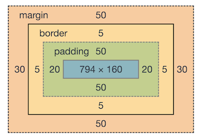

# webdev-html-notes

Korte notities gemaakt tijdens de workshop.


## Introductie

Tip: Installeer ['live server'](https://marketplace.visualstudio.com/items?itemName=ritwickdey.LiveServer)

Voorbeeld Jasper > Zie folder demo

- Browser is lief voor je, fouten niet altijd zichtbaar, dus > netjes werken. :heart_eyes:
- Snel een web pagina de basis HTML maken? ! + enter OF html:5 + enter. 
- Alles in de **body** is zichtbaar op de pagina 
- Alles in de HEAD zijn instructies voor dingen buiten de pagina

## Basis HTML

- Verschillende type elementen
- Element heeft attributen met een value
- Elementen kun je nesten

```html
<element attribuut="value"></element>
```

## Basis CSS

- CSS is cascading, dus volgorde in je css sheet is belangrijk
- Verzin duidelijke namen voor je klasse
- GEEN INLINE STYLING! :angry:
- Gebruik geen float (alleen om plaatjes uitlijnen) :angry:
- Gebruik GEEN tables voor layout, alleen als je een tabel wil tekenen.  :angry:

## Flexbox :sunglasses:

- Voor het op maken van lyouts
- flexcontainers = fancy
- oefenen met > https://flexboxfroggy.com/
- Eventueel combineren met [Bootstrap](https://getbootstrap.com/)
- Het kan zijn dat dingen niet passe, check dan even de boxmodel in de devtools van je browser hoe groot items 'echt' zijn. 


 

*Img 1. Boxmodel*


